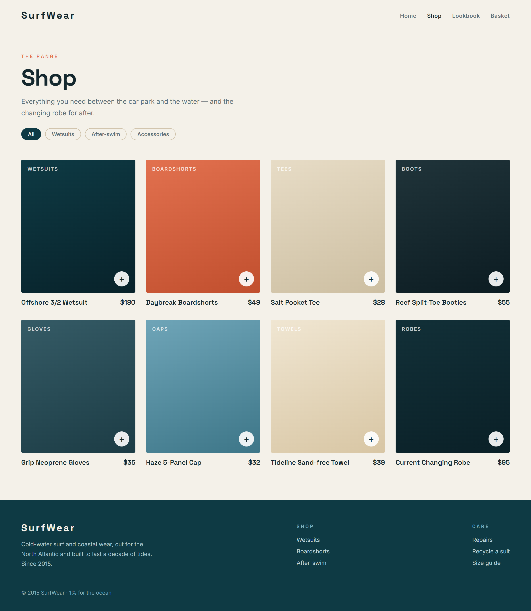
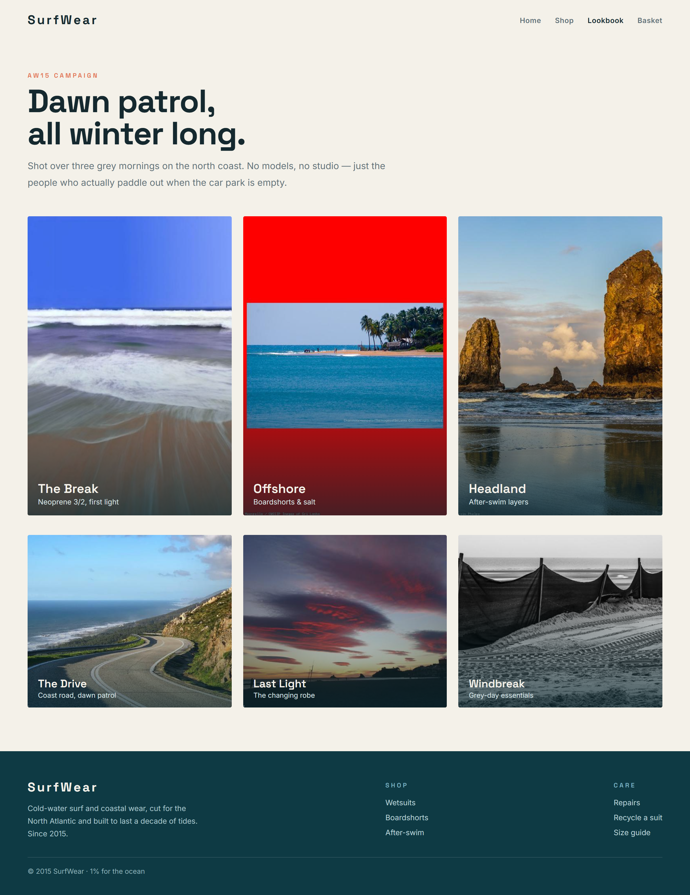
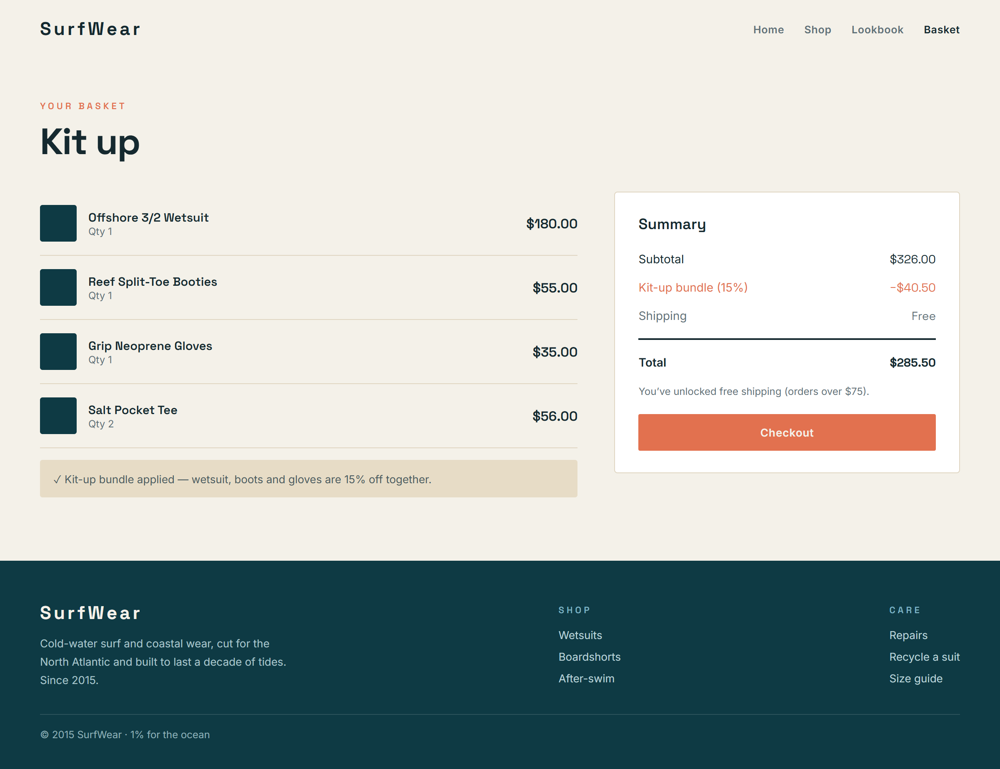

# tidewear

> A design-forward brand and shop site for a cold-water surf and coastal apparel label.

| | |
|---|---|
| **Industry** | surf / coastal lifestyle apparel |
| **Tech stack** | HTML5, CSS3, JavaScript |
| **Started** | 2015 |

## Overview

A design-forward brand and shop site for a cold-water surf and coastal apparel label: a bright editorial lookbook with Space Grotesk type, big coastal photography and clean colour-swatch product cards, plus a basket-pricing core (bundle discount + free-shipping threshold) verified in Node.

## Key features

- Airy coastal editorial design: Space Grotesk display, foam/sea/coral palette
- Big coastal campaign photography (hero + AW15 lookbook grid)
- Colour-swatch product cards for a clean, photo-free shop grid
- Basket pricing: kit-up bundle discount (wetsuit+boots+gloves) + free-shipping threshold
- Static HTML/CSS/JS; the basket core is verified in Node (scripts/verify-core.mjs)

## How it works

Basket pricing: quantity-aware subtotal, a 'kit up' bundle discount (15% off wetsuit + boots + gloves when all three are present), and a free-shipping threshold with flat-rate fallback

## Tech stack

- **HTML5**
- **CSS3**
- **JavaScript**

## Getting started

### Prerequisites

- **Node.js 20+** (to verify the core)
- Any static file server (no build step)

### Run

```sh
python -m http.server 8000   # then open http://localhost:8000
```

### Test / verify

```sh
node scripts/verify-core.mjs
```

## Project structure

```
tidewear/
  .gitignore
  README.md
  assets/
  cart.html
  docs/
  index.html
  lookbook.html
  scripts/
  shop.html
```

## Screenshots

| Home | Shop |
|---|---|
|  |  |

| Lookbook | Cart |
|---|---|
|  |  |

## Documentation

- [`README.md`](README.md)
